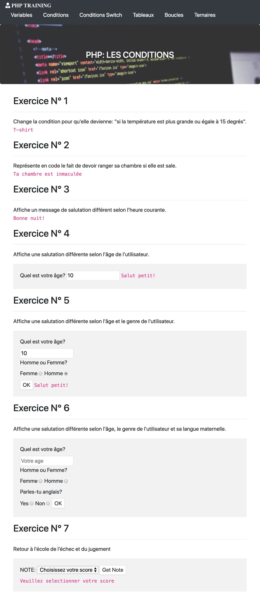

# PHP Training 1 & 2 Partie

**By:**  [Meilyn ANDRADE](www.github.com/Meilyn)

**Where**: BeCode [Junior Web Developper]

**When**: March 2019 

**DeadLine** : 

**Status**: In progress

## Technologies Utilisées pour cet projet

* HTML & CSS
* Bootstrap [Framework]
* PHP
* Time

## Exercices

Ex."Les conditions"

